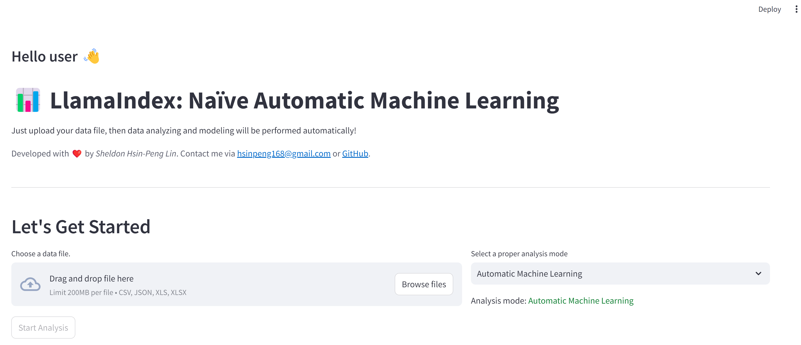

# LlamaIndex: Automatic Machine Learning by LLM
This application leverages OpenAI's language models and LlamaIndex's agents and tools to provide users with automatic machine learning and data visualization of the upload file. 



## Python Libraries
This application is powered by several libraries:
- [Streamlit](https://streamlit.io/): For the User Interface 🖥️
- [scikit-learn](https://scikit-learn.org/stable/): For performing machine learning tasks 🧑‍💻
- [XGBoost](https://xgboost.ai/): The regularizing gradient boosting framework 🛠️
- [statsmodels](https://www.statsmodels.org/stable/index.html): For performing statistical tests and data exploration 📉
- [seaborn](https://seaborn.pydata.org/): For performing statistical data visualization 📊
- [LlamaIndex](https://www.llamaindex.ai/): For creating LLMs agents and tools 🔗
- [OpenAI](https://openai.com/): The Large Language Models (LLM) provider 🧠


# Getting started 🏁

## Requirements

The [Python Runtime Environment](https://www.python.org/) should be installed on your computer.
Please choose the latest version of Python 3. The tested Python version is 3.10.12 on Ubuntu 22.04.5 LTS.


## Installation

Clone the repository and install the dependencies:

```bash
git clone [this repository]
cd LlamaIndex-Automatic-Machine-Learning-by-LLML
python3 -m pip install -r requirements.txt
```

## Run the application

```bash
streamlit run app.py
```
 
# Usage 📖
Under Construction.


# Features ✨
Under Construction.


# Limitations ⚠️
Under Construction.


# Improvements 🚀
Under Construction.


# Background 🧑‍🎓
My name is [Sheldon Hsin-Peng Lin](https://www.linkedin.com/in/sheldon-hsin-peng-lin-51306685/). I'm a software engineer and a research staff. I build various applications in telecommunication industry. 👨‍🔧
Since LLMs are really good at understanding human semantics, and an agent can perform machine learning tasks automatically by LLM reasoning and tool calling. 📚
This application is developed based on the above conditions, and I hope it can help you as well. 👍


# Acknowledgements 🙏
Under Construction. ❤️